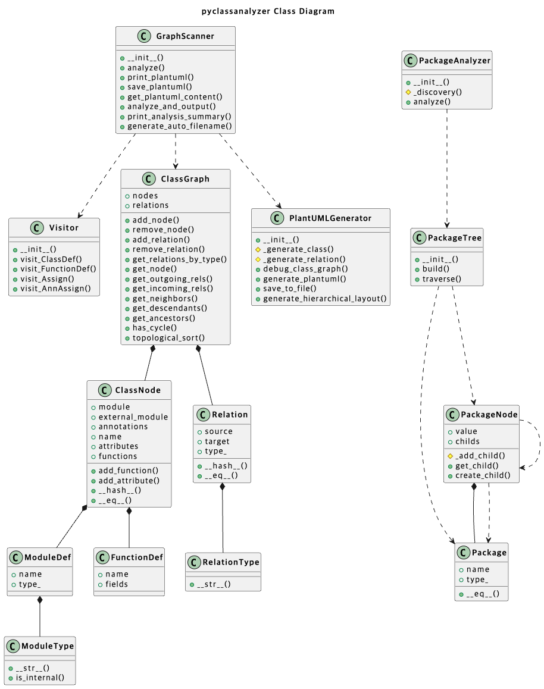

## pyclassanalyzer

pyclassanalyzer automatically analyze the class structure of python project and export the result as diagram.

### Features

Automatic Analysis: Parses python codebase to extract class information(attributes, methods) and relationship(inheritance, composition).

PlantUML Output: Generates class diagrams compatible with PlantUML.

### Prerequisites

You need to install java, Graphviz to use PlantUML.

### How to use

```bash
python3 -m pyclassanalyzer.cli [path] [options]
```

#### Options

| Option                | Description                       | Default            |
| --------------------- | --------------------------------- | ------------------ |
| `--output`, `-o` NAME | Specify output PlantUML file name | class_diagram.puml |
| `--no-test`           | Exclude test files from analysis  | false              |
| `--summary`           | Print summary only                | false              |

#### Example

```bash
python3 -m pyclassanalyzer.cli ./pyclassanalyzer --no-test --summary
```

##### Output

###### summary

```
=== 분석 결과 요약 ===
발견된 패키지 수: 5
발견된 클래스 수: 7
외부 클래스 수: 14
상속 관계 수: 2
조합 관계 수: 6
총 속성 수: 10
총 메서드 수: 44

패키지 목록:
  - analyzer
  - generators
  - pyclassanalyzer
  - types
  - visitors

외부 클래스 목록:
  - AnalysisResult
  - Any
  - BaseVisitor
  - ClassVisitor
  - Dict
...

클래스별 속성 정보:
  ClassVisitor:
    - member_analyzer (instance_variable, public, MemberAnalyzer)
    - current_class (dynamic_attribute, public, NoneType)
  BaseVisitor:
    ...
  ClassAnalyzer:
    - result (instance_variable, public, AnalysisResult)
    - import_visitor (instance_variable, public, ImportVisitor)
    - class_visitor (instance_variable, public, ClassVisitor)
    - member_analyzer (instance_variable, public, MemberAnalyzer)
    - plantuml_generator (instance_variable, public, PlantUMLGenerator)
```

###### diagram


