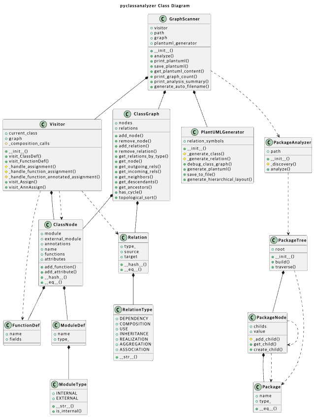

# pyclassanalyzer

**pyclassanalyzer** automatically analyzes the class structure of a Python project and exports the results as a diagram.

> [!IMPORTANT]  
> Using the dataclass(@dataclass) may cause errors when working with older versions(< [v1.2025.4](https://github.com/plantuml/plantuml/releases/tag/v1.2025.4)) of the PlantUML engine.

## Features

- **Automatic Analysis:** Parses your Python codebase to extract class information (attributes, methods) and relationships (inheritance, composition, usage).
- **PlantUML Output:** Generates class diagrams compatible with PlantUML.

## Prerequisites

To use PlantUML output, you need to have **Java** and **Graphviz** installed.

## How to Use

```bash
python3 -m pyclassanalyzer.cli [path] [options]
```

### Options

| Option                | Description                                                                 | Default                           |
| --------------------- | --------------------------------------------------------------------------- | --------------------------------- |
| `path`                | Path to the Python file or directory to analyze                             |                                   |
| `--output`, `-o` NAME | Specify the output PlantUML file name                                       | `{project_name}_{timestamp}.puml` |
| `--summary`           | Print a summary of the analysis results                                     |                                   |
| `--title`, `-t` TITLE | Set the diagram title (auto-generated based on the project name by default) |                                   |
| `--exclude` FOLDER    | Exclude a folder from analysis (currently, only one folder is supported)    |                                   |

##### Example


