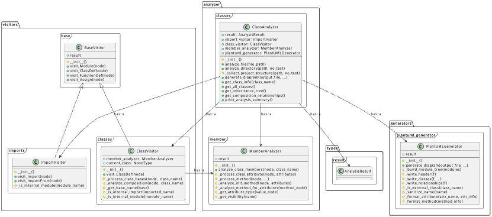

## pyclassanalyzer

pyclassanalyzer automatically analyze the class structure of python project and export the result as diagram.

### Features

Automatic Analysis: Parses python codebase to extract class information(attributes, methods) and relationship(inheritance, composition).

PlantUML Output: Generates class diagrams compatible with PlantUML.

### Prerequisites

You need to install java, Graphviz to use PlantUML.
